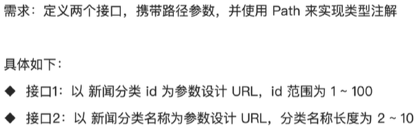
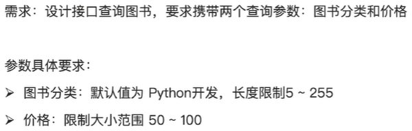
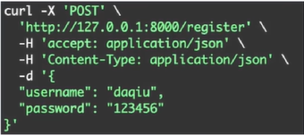
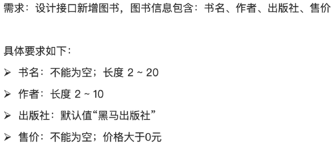

# **FastAPI简介**

## **为什么agent落地需要使用FastAPI**

1. FastAPI原生异步支持
2. FastAPI性能好
3. 能生成可交互式文档 (在 http://127.0.0.1:8000/docs中)

## **运行FastAPI方式**

1. Pycharm当中直接点击run按钮
2. 命令行当中输入uvicorn main:app --reload (--reload加上会在修改代码之后自动每次更新网页)

# **FastAPI框架**

## **requirements**

```Python
from fastapi import FastAPI
#创建FastAPI实例
app = FastAPI()
```

## **路由**

就是URL地址和处理函数之间的映射关系，它决定了当用户访问某个特定网址时，服务器应该执行哪段代码来返回结果。

### **代码示例**

```python
#装饰器：FastAPI示例.请求方法("请求路径")
@app.get("/")
async def root():
    #响应结果
    return {"message":"Hello World"}
```

### **练习**


```python
@app.get("/user/hello")
async def get_hello():
    return {"msg":"我正在学习FastAPI"}
```

## **参数**

是客户端发送请求时附带的额外信息和指令

常见的参数分为三类：

1. 路径参数
2. 查询参数
3. 请求体参数

### **路径参数**

- 位置：URL路径的一部分 如：/book/{id}
- 作用：指向唯一的、特定的资源
- 方法：GET

#### **代码示例**

```python
@app.get("/book/{id}")
async def get_book_id(id: int):
    return {"id":id,"msg":f"这是第{id}本书"}
```

#### **练习**


```python
@app.get("/user/{id}")
async def get_user_id(id: int):
    return {"id":id,"msg":f"普通用户{id}"}
```

#### **类型注解Path**

FastAPI允许用Path为路径参数声明额外的信息和校验

需要导入Path库：

```python
from fastapi import FastAPI,Path
```

Path常用参数：

| 参数        | 含义                           |
| :---------- | :----------------------------- |
| le          | 对整型类型限制，表示小于等于   |
| lt          | 对整型类型限制，表示小于       |
| ge          | 对整型类型限制，表示大于等于   |
| gt          | 对整型类型限制，表示大于       |
| min_length  | 对字符串类型限制，表示最小长度 |
| max_length  | 对字符串类型限制，表示最大长度 |
| ...         | 表示该字段必须提供，不能为空   |
| description | 为该参数添加注释               |


##### **代码示例**

```python
@app.get("/book/{id}")
async def get_book_id(id: int = Path(..., lt)):
	return {"id":id,"msg":f"这是第{id}本书"} 
```

##### **练习**



```python
#接口1
@app.get("/news/{id}")
async def get_news_id(id: int = Path(..., ge = 1,le = 100)):
    return {"id":id,"msg":f"新闻分类id为{id}"}
```

```python
#接口2
@app.get("/news/{name}")
async def get_news_name(name: str = Path(..., min_length = 2,max_length = 10)):
    return {"name":name,"msg":f"新闻分类name为{name}"}
```

### **查询参数**

声明的参数不是路径参数时，路径操作函数会把该参数自动解释为查询参数

- 位置：URL?之后 如k1=v1&k2=v2
- 作用：对资源集合进行过滤、排序、分页等操作
- 方法：GET

#### **代码示例**

```python
# 查询新闻：具有分页操作 skip：跳过的记录数；limit：返回的记录数 10
@app.get("/news/news_list")
async def get_news_list(skip: int,limit: int = 10):
    return {"skip":skip,"limit":limit}
```

#### **类型注解Query**

FastAPI允许用Query为查询参数声明额外的信息和校验

需要导入Query库：

```python
from fastapi import FastAPI,Query
```

Query常用参数：

| 参数        | 含义                           |
| :---------- | :----------------------------- |
| le          | 对整型类型限制，表示小于等于   |
| lt          | 对整型类型限制，表示小于       |
| ge          | 对整型类型限制，表示大于等于   |
| gt          | 对整型类型限制，表示大于       |
| min_length  | 对字符串类型限制，表示最小长度 |
| max_length  | 对字符串类型限制，表示最大长度 |
| ...         | 表示该字段必须提供，不能为空   |
| description | 为该参数添加注释               |
| default     | 为该参数设置默认值             |

##### **代码示例**

```python
# 查询新闻：具有分页操作 skip：跳过的记录数；limit：返回的记录数 10
@app.get("/news/news_list")
async def get_news_list(
	skip: int = Query(0,description = "跳过的记录数，默认0",lt = 100),
    limit: int = Query(10,description = "返回的记录数，默认10")
):
    return {"skip":skip,"limit":limit}
```

##### **练习**



```python
@app.get("/book")
async def get_book(
	classify: str = Query("Python开发",min_length = 5,max_length = 255),
    price: int = Query(50,ge = 50,le = 100)
):
    return {"classify":classify,"price":price}
```

### **请求体参数**

在HTTP协议当中，一个完整的请求由三部分组成：

1. 请求行：包含方法、URL和协议版本
2. 请求头：元数据信息 (Content-Type、Authorization等)
3. 请求体：实际要发送的数据内容

请求体参数主要有：

- 位置：HTTP请求的消息体 (body)中
- 作用：创建、更新资源，携带大量数据，如：JSON
- 方法：POST，PUT等

需要导入BaseModel库：

```python
from pydantic import BaseModel
```

#### **代码示例**

```python
class User(BaseModel):
    username: str
    password: str

@app.post("/register")
async def register(user: User):
	return user
```

输出的部分是在-d当中，如下图：



#### **练习**


```python
class Book(BaseModel):
    name: str
    writer: str
    publisher: str
    price: int

@app.post("/add")
async def add(book: Book):
    return book
```

#### **类型注解Field**

需要导入Field函数：

```python
from pydantic import BaseModel,Field
```

Field常用参数：

| 参数        | 含义                           |
| :---------- | :----------------------------- |
| le          | 对整型类型限制，表示小于等于   |
| lt          | 对整型类型限制，表示小于       |
| ge          | 对整型类型限制，表示大于等于   |
| gt          | 对整型类型限制，表示大于       |
| min_length  | 对字符串类型限制，表示最小长度 |
| max_length  | 对字符串类型限制，表示最大长度 |
| ...         | 表示该字段必须提供，不能为空   |
| description | 为该参数添加注释               |
| default     | 为该参数设置默认值             |

##### **代码示例**

```python
class User(BaseModel):
	username: str = Field(default="张三",min_length = 2,max_length = 10,description = "用户名，长度2~10")
    password: str = Field(min_length = 3,max_length = 20)

@app.post("/register")
async def register(user: User):
    return user
```

##### **练习**



```python
class Book(BaseModel):
    book: str = Field(...,min_length = 2,max_length = 20,description = "书名不能为空，长度2~20")
    writer: str = Field(min_length = 2,max_length = 10)
    publisher: str = Field(default = "xxx出版社")
    price: int = (...,gt)

@app.post("/add")
async def add(book: Book):
    return book
```

## **请求与响应**

### **响应类型**

默认情况下，FastAPI会自动将路径操作函数返回的Python对象 (字典、列表、Pydandic模型等)，经由jsonable_encoder转换为JSON兼容格式，并包装为JSONResponse返回。省去了手动序列化的步骤，使得开发者能够专注于业务逻辑。

如果需要返回非JSON数据 (如HTML、文件流)，FastAPI提供了丰富的响应类型来返回不同数据。

| 响应类型          | 用途                       | 示例                              |
| ----------------- | -------------------------- | --------------------------------- |
| JSONResponse      | 默认响应，返回JSON格式数据 | return {"key":"value"}            |
| HTMLResponse      | 返回HTML内容               | return HTMLResponse(html_content) |
| PlainTextResponse | 返回纯文本                 | return PlainTextResponse("text")  |
| FileResponse      | 返回文件下载               | return FileResponse(path)         |
| StreamingResponse | 流式响应                   | 生成器函数返回数据                |
| RedirectResponse  | 重定向                     | return RedirectResponse(url)      |

#### **响应类型设置方式**

1. 装饰器中指定相应类
2. 返回响应对象

##### **装饰器中指定相应类**

- 场景：固定返回类型 (HTML、纯文本等)

需要导入HTMLResponse：

```python
from fastapi import FastAPI,HTMLResponse
```

###### **代码示例**

```python
@app.get("/html",response_class=HTMLResponse)
async def get_html():
    return "<h1>这是标题</h1>"
```

##### **返回响应对象**

- 场景：文件下载、图片、流式响应

需要导入FileResponse：

```python
from fastapi import FastAPI,FileResponse
```

###### **代码示例**

```python
@app.get("/file")
async def get_file():
    file_path="./files/1.png"
    return FileResponse(file_path)
```

##### **自定义响应数据格式**

response_model是路径操作装饰器 (如@app.get或@app.post)的关键参数，它通过一个Pydantic模型来严格定义和约束API端点的输出格式。这一机制在提供自动数据验证和序列化的同时，更是保障数据安全性的第一道防线。

需要导入BaseModel：

```python
from pydantic import BaseModel 
```

###### **代码示例**

```python
class News(BaseModel):
    id: int
    title: str
    content: str
    
@app.get("/news/{id}",response_mode=News)
async def get_news(id: int):
    return {
        "id":id,
        "title":f"这是第{id}本书",
        "content":"这是一本好书"
    }
```

## **异常处理**

对于客户端引发的错误 (4xx，如资源未找到、认证失败)，应使用fastapi.HTTPException来终端正常处理流程，并返回标准错误响应。

需要导入HTTPException：

```python
from fastapi import FastAPI,HTTPException
```

### **代码示例**

```python
# 需求：按id查询新闻 id(1~6)
@app.get("/news/{id}")
async def get_news(id: int):
    id_list=[1,2,3,4,5,6]
    if id not in id_list:
        #状态码status_code必须写，detail写错误原因
    	raise HTTPException(status_code=404,detail="查找的ID不存在")
    else:
        return {"id":id}
```

